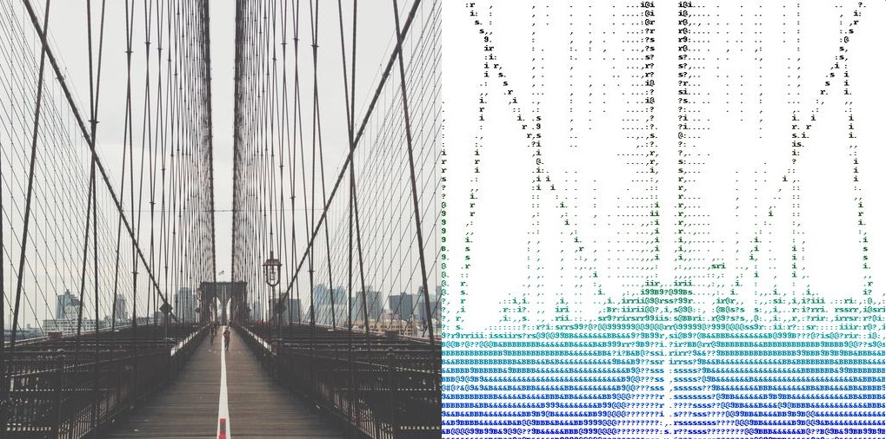

# ASCIIGan

Keras implementation for learning a mapping from input images to corresponding ASCII art, for example:

Due to computational limitations, I have taken a very small dataset containing 400 images. All the data have been collected from https://picsum.photos/. The pairs were generated using basic image processing. The generation process has been documented in this [notebook](https://github.com/jojo96/ASCIIGan/blob/main/notebooks/AsciiTrainingDataGen.ipynb).

## Setup

The whole project has been carried out on Google Colab.

## Datasets
The dataset can be found in this folder and is also available on [Kaggle](https://www.kaggle.com/jojo096/imagetoasciiart)

## Models
A pretrained model is provided can be downloaded from https://drive.google.com/file/d/1Z3xFnExTV-Jv3-KY1VU3wQCNm_0zLjq-/view?usp=sharing

## Setup Training and Test data
### Generating Pairs
The general training process has been described in this [notebook](https://github.com/jojo96/ASCIIGan/blob/main/notebooks/TrainingASCIIGan.ipynb).

## Display UI
A streamlit app is developed to show the results. The app can be accessed here: [ASCII app](https://share.streamlit.io/jojo96/asciigan/main/asciiGan.py)

## Acknowledgments

Image-to-Image Translation with Conditional Adversarial Networks  
 [Phillip Isola](http://web.mit.edu/phillipi/), [Jun-Yan Zhu](https://www.cs.cmu.edu/~junyanz/), [Tinghui Zhou](https://people.eecs.berkeley.edu/~tinghuiz/), [Alexei A. Efros](https://people.eecs.berkeley.edu/~efros/)   
 CVPR, 2017.

Code borrows heavily from [How to Develop a Pix2Pix GAN for Image-to-Image Translation
](https://machinelearningmastery.com/how-to-develop-a-pix2pix-gan-for-image-to-image-translation/) and [Build a Pix2Pix GAN With Python](https://medium.com/swlh/build-a-pix2pix-gan-with-python-6db841b302c7). The data is modified from [Lorem Picsum](https://picsum.photos/). 
